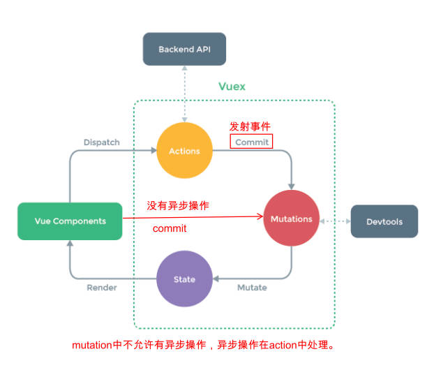

# vue-router知识补充

vue-router4删除了router-linke上`tag`属性，使用插槽的方式来渲染内容。

------

router-link结合插槽的基本使用，放入普通元素和组件。

```vue
<template>
  <div>
    <router-link to="/home">
      <button>首页</button>
      <Foo></Foo>
    </router-link>
    <router-link to="/about">关于</router-link>
    <router-view></router-view>
  </div>
</template>
```

------

router-link增强，结合作用域插槽`v-slot`如何使用。

1. 在router-link组件上使用`custom`表示自定义元素，否则内容外层会包裹`<a>`
2. 使用`v-slot`(独占默认插槽语法)，来获取作用域插槽内部传递的对象，对象中有以下属性：
   - href：解析后的url，如"/home".
   - route：解析后的规范化route对象，里面有params，query，meta等属性。
   - navigate：触发导航的函数。
   - isActive：是否匹配状态。
   - isExactActive：与嵌套组件有关，是否精确匹配状态。

App.vue

```vue
<template>
  <router-link to="/home" v-slot="slotProps" custom>
    <button @click="slotProps.navigate">{{slotProps.href}}</button>
    <span :class="{'active': slotProps.isActive}">{{slotProps.isActive}}</span>
  </router-link>
  <router-link to="/about">关于</router-link>
  <router-view></router-view>
</template>
<style scoped>
.active { color: green; }
</style>
```

------

不能通过router-view拿到组件，它只能起到占位的作用。

------

router-view增强，结合作用域插槽v-slot，使用动态组件，缓存，动画。

```vue
<template>
	<router-link to="/home">主页</router-link>
  <router-link to="/about">关于</router-link>
	<!-- slotProps解构：{ Component } -->
  <router-view v-slot="{ Component }">
    <transition name="zzt" mode="out-in" appear>
      <keep-alive>
        <component :is="Component"></component>
      </keep-alive>
    </transition>
  </router-view>
</template>
<style scoped>
.zzt-enter-from,
.zzt-leave-to {
  opacity: 0;
}
.zzt-enter-active,
.zzt-leave-active {
  transition: opacity 0.3s ease;
}
</style>
```

router-view使用`v-slot`来获取作用域插槽内部传递的对象，对象中有以下属性：

- Component：要渲染的组件。
- route：解析出的标准化路由对象。里面有params，query，meta等属性。

------

动态添加路由的使用场景：

- 根据用户不同的权限，注册不同的路由。

动态添加一个一级路由和二级路由

src/router/index.js

```javascript
const router = createRouter({
	routes,
	history: createWebHistory()
})
// 动态添加路由, 一级路由
router.addRoute({
	path: '/category',
	component: () => import('../pages/Category.vue')
})
// 添加二级路由，第一个参数是一级路由的name
router.addRoute("home", {
  path: "moment", // 要么写完整路径‘/home/moment’，要么写成‘moment’
  component: () => import("../pages/HomeMoment.vue")
})
export default router
```

------

动态删除路由的3种方式：

- 添加一个name相同的路由做替换。

  ```javascript
  router.addRoute({	path: '/category', name: 'category', component: Category })
  router.addRoute({	path: '/other', name: 'category', component: Other }) // 使用/other替换/category
  ```

- 通过`removeRoute`的方法，传入路由的名称。

  ```javascript
  router.addRoute({	path: '/category', name: 'category', component: Category })
  router.removeRoute('category')
  ```

- 通过`addRoute`方法的返回函数回调。

  ```javascript
  const removeRoute = router.addRoute({	path: '/category', name: 'category', component: Category })
  removeRoute()
  ```

------

路由的2个其他方法

- router.hasRoute(name)：检查路由是否存在。
- router.getRoutes()：获取一个包含所有路由的记录数组。

------

路由导航守卫的使用场景：

- 用户访问某一页面，如果处于未登陆的状态，那么跳转到登陆页面。

------

全局前置守卫`beforeEach`的基本使用，

回调函数传入的2个参数：

- to：即将进入的路由Route对象。
- from：即将离开的路由Route对象。

回调函数的返回值：

- false；取消当前导航。
- undefined：进行默认导航。
- 一个路由地址，
  - 一个string类型的路径。
  - 一个对象，其中包含path, query, params，相当于router.push()中传入的对象（route对象）。

回调函数第三个参数next：

1. Vue2中通过next函数来决定如何跳转。
2. Vue3中使用返回值来控制，不推荐使用next函数。因为开发中容易调用多次。

src/router/index.js

```javascript
router.beforeEach((to, from, next) => {
  if (to.path.indexOf("/home") !== -1) { // 访问/home时，跳转到/login
    return "/login"
  }
  // next已不推荐使用
})
```

------

登陆守卫功能的实现：

Login.vue

```vue
<template>
	<div>
    Login
    <button @click="loginClick">登录</button>
  </div>
</template>
<script setup>
import { useRouter } from 'vue-router'
const router = useRouter();
const loginClick = () => {
	window.localStorage.setItem("token", "zzt")
	router.push({ path: "/home" })
}
</script>
```

src/router/index.js

```javascript
router.beforeEach((to, from) => {
  if (to.path !== "/login") {
    const token = window.localStorage.getItem("token");
    return !token ? '/login' : undefined
  }
})
```

------

了解其它的导航守卫和他们的触发流程：

1. 导航被触发。

2. 在失活的组件里调用 `beforeRouteLeave` 守卫。

3. 调用全局的 `beforeEach` 守卫。

4. 在重用的组件里调用 `beforeRouteUpdate` 守卫(2.2+)。本质上未跳转，而是组件发生更新。

5. 在路由配置里调用 `beforeEnter`。可在路由配置中配置。

6. 解析异步路由组件。

7. 在被激活的组件里调用 `beforeRouteEnter`。

8. 调用全局的 `beforeResolve` 守卫(2.5+)。

9. 导航被确认。

10. 调用全局的 `afterEach` 钩子。

11. 触发 DOM 更新。

12. 调用 `beforeRouteEnter` 守卫中传给 `next` 的回调函数，创建好的组件实例会作为回调函数的参数传入。

    ```javascript
    beforeRouteEnter (to, from, next) {
      next(vm => {
        // 通过 `vm` 访问组件实例
      })
    }
    ```

------

# Vuex起步

什么是状态管理？

- 对于应用中各种复杂数据的管理。

什么是状态管理中的view，state，action

- view：组件template模块渲染成DOM。
- state：组件中data，setup返回的数据。
- action：组件中产生的修改`state`的事件。

------

复杂的状态包含哪几个方面数据：

- 服务器返回的数据，缓存数据，用户操作产生的数据。
- UI状态，如元素是否被选中，是否显示加载动效，当前分页。

------

复杂状态共享包括3个场景：

- 深层父传子。子传父，兄弟共享。

复杂状态共享2个维度：

- 多个视图，依赖同一状态。
- 来自不同视图的行为，需要变更同一状态。

------

Vuex状态管理的模式

1. 将组件内部状态抽离出来，以一个全局单例的方式来管理。
2. 通过定义和隔离状态管理的各个概念，并通过强制性的规则，来维护 view 和 state 的独立性

理解Vuex的状态管理图。



------

vue devtool 的使用场景：

- 对组件或者Vuex进行调试。

------

Vuex的使用步骤

1. 安装vuex

   ```shell
   npm install vuex
   ```

2. 使用vuex中的`createStore`创建store，本质上是一个容器，包含应用中大部分state

3. 配置store的状态管理。

4. 在全局使用`app.use(store)`安装插件。

5. 组件中使用store

Vuex和全局对象有什么区别：

1. Vuex状态存储是响应式的。
2. 不能直接改变store中的状态，唯一途径是**显示提交（commit）mutation**

------

使用Vuex实现计数器案例。

src/store/index.js

```javascript
import { createStore } from 'vuex'
const store = createStore({
	state() {
		return {
			rootCounter: 100
		}
	},
  // mutation中不允许有异步操作，异步操作在action中处理。
	mutations: {
		increment(state) {
			state.rootCounter++
		},
		decrement(state) {
			state.rootCounter--
		},
	}
})
export default store
```

main.js

```javascript
import { createApp } from 'vue'
import App from './App.vue'
import store from './store'
// app.use(store)时，加入了全局属性$store
createApp(App).use(store).mount('#app')
```

App.vue

```vue
<template>
  <div>
    <h2>当前计数：{{ $store.state.rootCounter }}</h2>
    <button @click="increment">+1</button>
    <button @click="decrement">-1</button>
  </div>
</template>
<script>
export default {
  data() {
    return {}
  },
  methods: {
    increment() {
      this.$store.commit('increment')
    },
    decrement() {
      this.$store.commit('decrement')
    },
  }
}
</script>
```

