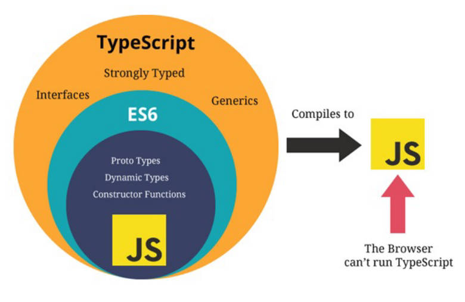

理解JS, ES, TypeScript关系图。



------

TS中 number 类型的理解。

- 与JS一样，不区分整数类型（int）和浮点类型（double），统一为 number 类型。
- 支持ES6新增的二进制，八进制，十六进制。

```typescript
let num1: number = 10
let num2: number = 6.6
let num3: number = 0b110 // 二进制
let num4: number = 0o567 // 八进制
let num5: number = 0xf23 // 十六进制
```

------

TS中 boolean 类型的理解。

- 只有2个值，true 和 false

```typescript
let flag: boolean = true
flag = false
```

------

TS中 string 类型的理解。

- 字符串类型，可以使用单引号或双引号表示。
- 支持ES6模板字符串。

```typescript
const name: string = 'zzt'
const msg: string = `Hello, ${name}`
```

------

TS中 Array 类型理解，推荐写法和不推荐写法，为什么。

- TS数组中存放不同类型的值，是一个不好的习惯。

```typescript
const names: string[] = ['abc', 'cba', 'nba'] // 推荐写法
const names2: Array<string> = ['abc', 'cba', 'nba'] // 不推荐写法，在jsx中解析有问题。
```

------

TS中 object 类型的理解。

- object类型，用于描述一个对象。但不能从object中获取属性值，解决方法后面会讲到。
- 暂时最好使用类型推导来定义对象。

```typescript
const info: object = { name: 'zzt', age: 18 }
console.log(info.name) // 会报错 Property 'name' does not exist on type 
const info2 = { name: 'zzt', age: 18 } // 使用类型推导
```

------

TS中 symbol 类型的理解。

- 使用symbol来处理需要在对象中使用相同属性名的场景，Symbol函数会返回不同的值。

```typescript
const s1: symbol = Symbol('title')
const s2: symbol = Symbol('title')
const person = {
  [s1]: '程序员',
  [s2]: '学生'
}
```

------

TS中 null 和 undefined 类型的理解。

- 它们既是实际的值，也是自己的类型。
- null，undefined类型，只能赋值为null，undefined。
- 定义一个标识符为`null`, `undefined`，那么标识符的类型推导为 any。
- 开启TS严格模式后，赋值为`null`的标识符，不能再赋值其它类型。

```typescript
let a = null // a的类型推导为any
let n: null = null
let u: undefined = undefined
```

------

TS中any类型的理解。

- 讨巧的TS手段，可对该类型变量进行任何操作，包括获取不存在的属性，方法，或者赋任何值。

any使用场景：

- 确实无法确定变量类型，或者变量会发生变化。
- 处理一些繁琐的情况，不希望添加类型注解。
- 引入一些第三方库时，缺失了类型注解。
- 类型断言 as any，先转成 any，再转成其它类型。

```typescript
let a: any = 'zzt'
const arr: any[] = ['zzt', 18, 1.8] // 不推荐这么写
```

------

TS中 unknown 类型的理解，使用场景。

- 在TS1.3中推出，用于描述类型不确定的变量。
- 用于防止unknown类型的值，随意赋值给其他类型的标识符。

unknown类型与any类型的区别。

- unknown类型只能赋值给unknown或者any类型。
- any类型可以赋值给任何类型。

```typescript
let str: string
let msg: any
let msg2: unknown
let res: unknown = 'abc'
str = res // 会报错
msg = res
msg2 = res
```

------

TS中 void 类型的理解。

- 通常用于指定函数没有返回值，可将null和undefined赋值给void类型，也就是函数返回null或者undefined。
- 一般不手动指定，TS会自动推导。

```typescript
function sum(num1: number, num2: number): void {
  console.log(num1 + num2)
}
```

------

TS中 never 类型的理解，

- never表示永远不会发生值的类型。

never类型应用场景3点。

- 死循环函数

  ```typescript
  function foo(): never {
    while(true) { } // 死循环
  }
  ```
  
- 用于抛出异常的函数。

  ```typescript
  function bar(): never {
    throw new Error()
  }
  ```

- 用于帮助开发者规范函数可能会发生的扩展

  ```typescript
  // 如果该函数需要增加第三个参数，类型为boolean，那么必须新增case，用于处理boolean的情况，否则会报错。
  function handleMsg(msg: string | number) {
    switch (typeof msg) {
      case 'string':
        console.log("string处理方式处理message")
        break
      case 'number':
        console.log("number处理方式处理message")
        break
      default:
        const check: never = msg
    }
  }
  ```

------

TS的 tuple 理解，

- tuple是元组类型，意为多种元素的组合。

tuple和数组的区别：

1. 数组中建议存放相同类型元素，不同类型的元素可放在元组中。
2. 元组中每个元素都有自己特定的类型，根据索引值可以确定对应的类型。

```typescript
const info: [string, number, number] = ['zzt', 18, 1.88]
```

tuple 的使用场景：

- 通常作为返回值的类型。

实现react中的useState的案例。

```typescript
function useState(state: any) {
  let currentState = state
  const changeState = (newState: any) => {
    currentState = newState
  }
  const tuple: [any, (newState: any) => void] = [currentState, changeState]
  return tuple
}
// 使用泛型优化
function useState2<T>(state: T) {
  let currentState = state
  const changeState = (newState: T) => {
    currentState = newState
  }
  const tuple: [T, (newState: T) => void] = [currentState, changeState]
  return tuple
}
const [title, setTitle] = useState2("abc") // title的类型，根据useState2传值发生变化。
```

------

TS中函数的参数类型，返回值类型的理解。

- 声明函数时，可在每个参数后添加类型注解。
- 声明函数时，可在函数列表最后添加返回值的类型注解，一般无需手动添加，TS会根据返回值推导。

```typescript
function sum(num1: number, num2: number): number {
  return num1 + num2
}
```

------

TS中匿名（上下文）函数的参数理解。

- TypeScript根据上下文可以确定函数会被如何调用时，函数参数会自动指定类型。
- 这种情况也被称为上下文类型（contextual typing）

```typescript
const names: string[] = ['abc', 'cba', 'nba']
// item 会被自动指定string类型。
names.forEach(item => {
  console.log(item.toUpperCase())
})
```

------

TS中对象类型理解，

- 在对象类型中可以添加属性，并指定类型注解。不指定则是any类型。
- 属性之间可以使用 `,` 或者 `;` 来分割，最后一个分割符是可选的。

```typescript
function printPoint(point: {x: number, y: number}) {
  console.log(point.x);
  console.log(point.y)
}
printPoint({x: 123, y: 321})
```

TS中对象中的可选类型的理解。

- 可指定哪些属性是可选的，在属性后面添加一个 `?`

```typescript
function printPoint(point: {x: number, y: number, z?: number}) {
  console.log(point.x)
  console.log(point.y)
  console.log(point.z)
}
printPoint({x: 123, y: 321}) // 123 321 undefined
printPoint({x: 123, y: 321, z: 111})
```

------

TS中联合类型的理解，什么是 narrow，实现一个 narrow 案例。

- TS允许使用多种运算符构建新类型，联合类型使用 `|` 构建。
- 联合类型由两个或多个其它类型组成，表示值可以是其中任一类型。
- 组成联合类型的类型被称为“联合成员（union's members）”

```typescript
function printID(id: number | string | boolean) {
  // 整个if代码块称为 narrow: 缩小
  if (typeof id === 'string') { // 用于if判断的表达式称为类型保护。
    // TypeScript 帮助确定id一定是string类型
    console.log(id.toUpperCase())
  } else {
    console.log(id)
  }
}
```

------

可选类型用于函数参数与联合类型的关系，写法上有什么不同。

- 可选类型可以看作是 类型 和 undefined 的联合类型

```typescript
function foo(msg?: string) { console.log(msg) }
foo()
function bar(msg: string | undefined) { console.log(msg) }
bar(undefined) // 不能写bar()，必须传入undefined。
```

------

TS中类型别名的理解。

- type关键字，给类型注解起一个别名。

类型别名的使用场景：

- 在多个地方需要使用较长的类型注解，如对象类型和联合类型，可以给它们起一个别名。

```typescript
// type用于定义类型别名(type alias)
type IDType = string | number | boolean
type PointType = { x: number, y: number, z?: number }
function printId(id: IDType) {}
function printPoint(point: PointType) {}
```